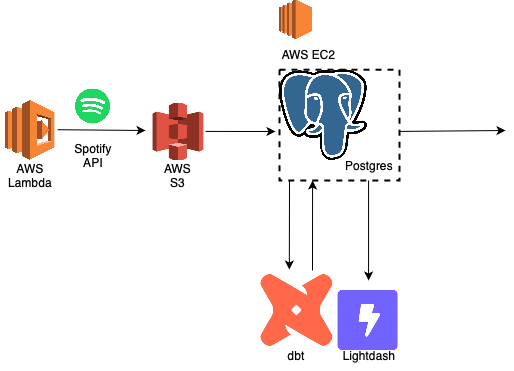

# Spotify Data Pipeline & Recommendation System

## Summary

This project is a data pipeline and recommendation system for Spotify. It is built using Python, PostgreSQL, dbt, and AWS services.  This is still a work in progress.

    
    
    
    
    
    
    
    
    
    
    
    

## Data Pipeline

The current data pipeline operates as follows:

A Lambda function triggers an hourly script that fetches the most recent tracks I’ve listened to using the Spotify API and stores the data in an S3 bucket.

When I’m ready to update the database, I manually start an EC2 instance and run the `update_db.py` script. This script uploads the new track data from S3 to a PostgreSQL database hosted on the EC2 instance. Once the database is updated, I run dbt run to refresh the dbt-managed tables.

## Recommendation System

Work in progress…

## Next Steps
- Create a base table for album metadata.
- Create a base table for artist metadata.
- Create a features table for albums.
- Create a features table for artists.
- Generate embedding vectors for each track using Word2Vec or a similar technique.
- Perform a nearest neighbor (NN) or approximate nearest neighbor (ANN) search to identify similar tracks—comparing tracks I’ve listened to with those I haven’t.
- Build a playlist populated with the recommended tracks.

