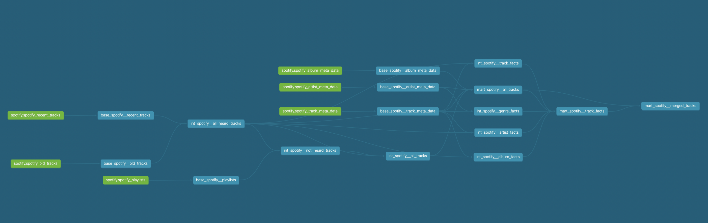

# Spotify Data Pipeline & Recommendation System

## Summary

This project is a data pipeline and recommendation system for Spotify. It is built using Python, PostgreSQL, dbt, and AWS services.  This is still a work in progress.

    
    
    
    
    
    
    
    
    
    
    
    
    

## Data Pipeline

The current data pipeline operates as follows:

    

A Lambda function triggers an hourly script that fetches the most recent tracks I’ve listened to using the Spotify API and stores the data in an S3 bucket.

When I’m ready to update the database, I manually start an EC2 instance and run the `update_db.py` script. This script uploads the new track data from S3 to a PostgreSQL database hosted on the EC2 instance. Once the database is updated, I run dbt run to refresh the dbt-managed models. The photo below shows the dbt models that are currently implemented.

    

I will be working on automating this process. To do this I will use AWS ECR and Fargate.

## Recommendation System

1. Track Collection from Spotify API

To build a diverse and current track database, I use the Spotify API to extract songs from curated playlists known to frequently include new releases. These playlists are manually sourced over time.
Due to limitations in Spotify’s API (specifically, the inability to search tracks by release date), this was the most reliable workaround for tracking recent songs. All gathered tracks are stored in a local database for further processing.

2. Feature Engineering with dbt

I use dbt (Data Build Tool) to refresh and manage data models, creating a series of feature tables that enhance the dataset. These include, but are not limited to:
	•	artist_listens
	•	skip_rates
	•	genre_listens

These features are merged throughout the dbt pipeline into a final enriched dataset: `mart_spotify__merged_tracks.sql`.
This table contains all relevant audio and contextual features for each track.

3. Similarity-Based Recommendations

From mart_spotify__merged_tracks.sql, I load the feature-rich dataset into memory.
	•	All numerical features are min-max scaled to the 0–1 range.
	•	Categorical variables are one-hot encoded.
The resulting dataset can be very large (e.g., ~100,000 rows × 10,000 columns), leading to high memory consumption.

To address this, I experimented with dimensionality reduction techniques such as:
	•	Feature hashing
	•	Sparse matrix representations
	•	Ultimately, I settled on Truncated SVD, which effectively reduced dimensionality while preserving similarity structure.

Tracks are then split into two groups:
	•	Recent releases (within the last 7 days)
	•	Previously liked or listened tracks

I compute cosine similarity between these groups to recommend newer songs that are most similar to my past listening preferences.

4. Playlist Creation and Upload

Finally, I generate a custom recommendation playlist using the selected tracks and upload it to Spotify via the API.

    

## Other Notes

- I am using the `pgAdmin` to manage my PostgreSQL database.
- I am using the `Lightdash` to view my dbt-managed tables.
- I am using the `Tailscale` to connect to the EC2 instance from any network. Currently, my EC2 only accepts connections from my home network so to bypass this I use Tailscale to connect to the EC2 instance from any network.

## Next Steps
- Investigate the use of Feature Hashing for the categorical features. 
- Investigate the use of GNNs for genre and artist recommendations.
- Investigate the use of reinforcement learning.
- Investigate alternate playlist recommendation methods similar to collobartive filtering.

## Future Ideas
I could use contrastive learning and a GNN to create an embedding vector for each genre. I would make a similiarity matrix based on the hop distance and the edge weighting between each genre. This similiraity matrix would then be used as the labels for each genre and an embedding can be constructed with a GNN and trained to minimise a constructive loss function with soft labels.
